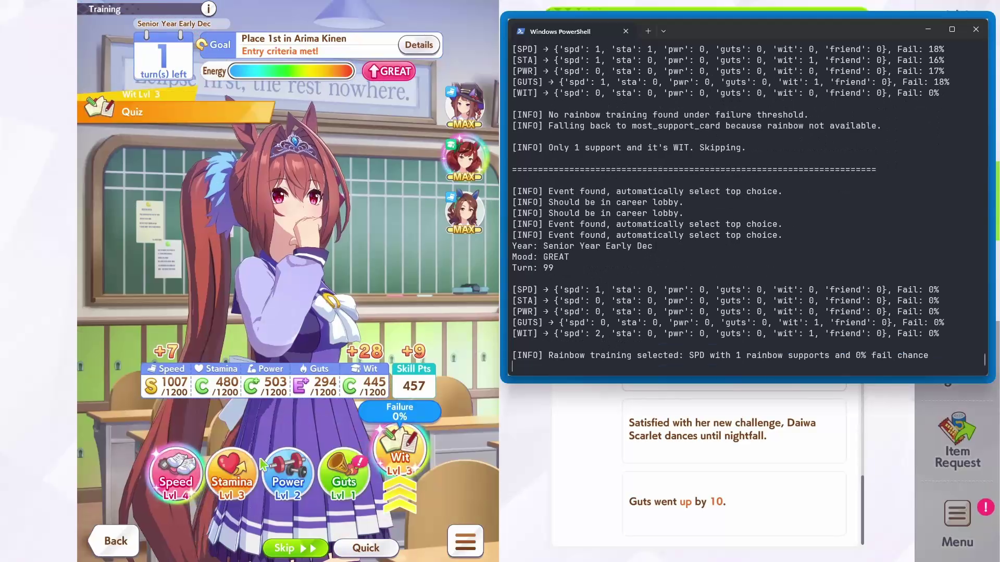

# Umamusume Auto Train

Like the title says, this is a simple auto training for Umamusume.

This project is inspired by [shiokaze/UmamusumeAutoTrainer](https://github.com/shiokaze/UmamusumeAutoTrainer)

Join our [discord server](https://discord.gg/vKKmYUNZuk)

[Demo video](https://youtu.be/CXSYVD-iMJk)



# ⚠️ USE IT AT YOUR OWN RISK ⚠️

I am not responsible for any issues, account bans, or losses that may occur from using it.
Use responsibly and at your own discretion.

## Emulator Branch

This branch is dedicated for emulator use.
For the Steam version, please check the [main branch](https://github.com/samsulpanjul/umamusume-auto-train).

⚠️ This branch is still under development, so you may encounter errors or bugs.
If you run into any issues, feel free to open an issue
or join our [Discord server](https://discord.gg/vKKmYUNZuk)
for discussion.

## Features

- Automatically trains Uma
- Keeps racing until fan count meets the goal, and always picks races with matching aptitude
- Checks mood
- Handle debuffs
- Rest
- Selectable G1 races in the race schedule
- Stat target feature, if a stat already hits the target, skip training that one
- Auto-purchase skill
- Web Interface for easier configuration
- Select running style position

## Getting Started

### Requirements

- [Python 3.10+](https://www.python.org/downloads/)
- [TesseractOCR](https://github.com/UB-Mannheim/tesseract/wiki)

### Setup

#### OCR Setup

1. Download the installer from [UB Mannheim Tesseract build](https://github.com/UB-Mannheim/tesseract/wiki).
2. Install it (default path usually: `C:\Program Files\Tesseract-OCR`).

**Note**: If pytesseract cannot find tesseract.exe, you may need to explicitly set the path in your code. Edit `core/ocr.py` (line 11):

```
pytesseract.pytesseract.tesseract_cmd = r"D:\Your\Custom\Path\tesseract.exe"
```

#### Clone repository

```
git clone https://github.com/samsulpanjul/umamusume-auto-train.git

cd umamusume-auto-train

git checkout -b emulator origin/emulator
```

#### Install dependencies

```
pip install -r requirements.txt
```

### BEFORE YOU START

Make sure these conditions are met:

- **Disable** all confirmation pop-ups in the game settings.
- **Stay** in the career lobby screen (the one with the Tazuna hint icon).
- **Enable** ADB Debugging on your emulator.
- **Set** the emulator resolution to **800x1080**.

### Start

Run:

```
python main.py
```

Start:
press `f1` to start/stop the bot.

### Configuration

Open your browser and go to: `http://127.0.0.1:8000/` to easily edit the bot's configuration.

### Training Logic

There are 2 training logics used:

1. Train in the area with the most support cards.
2. Train in an area with a rainbow support bonus.

During the first year, the bot will prioritize the first logic to quickly unlock rainbow training.

Starting from the second year, it switches to the second logic. If there’s no rainbow training and the failure chance is still below the threshold, it falls back to the first one.

### Known Issue

- Some Uma that has special event/target goals (like Restricted Train Goldship or ~~2 G1 Race Oguri Cap~~) may not working. For Oguri Cap G1 race event goal, you need to set the races in the race schedule that match the dates of her G1 goal events.
- OCR might misread failure chance (e.g., reads 33% as 3%) and proceeds with training anyway.
- Automatically picks the top option during chain events. Be careful with Acupuncture event, it always picks the top option.
- If you bring a friend support card (like Tazuna/Aoi Kiryuin) and do recreation, the bot can't decide whether to date with the friend support card or the Uma.

### Contribute

If you run into any issues or something doesn’t work as expected, feel free to open an issue.
Contributions are very welcome! If you want to contribute, please check out the [dev](https://github.com/samsulpanjul/umamusume-auto-train/tree/dev) branch, which is used for testing new features. I truly appreciate any support to help improve this project further.
